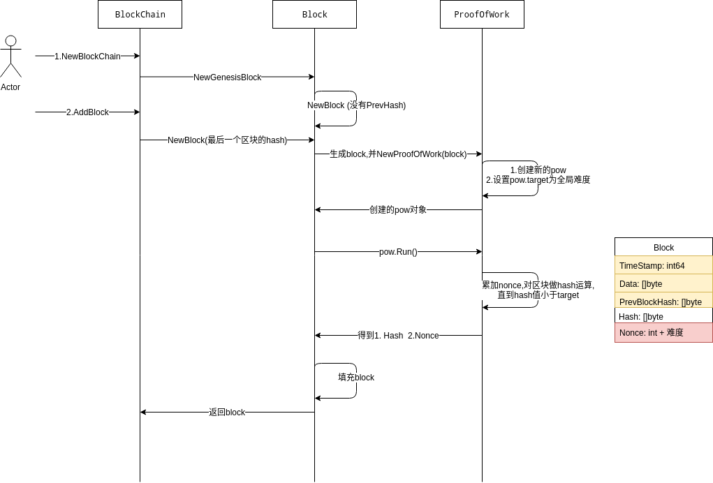

<!-- TOC -->

- [1. 说明](#1-说明)

<!-- /TOC -->


<a id="markdown-1-说明" name="1-说明"></a>
# 1. 说明

* https://github.com/Jeiwan/blockchain_go (参考的go实现)

```bash
# 参考的项目
go get github.com/Jeiwan/blockchain_go
```

增加区块(着重PoW过程)  

