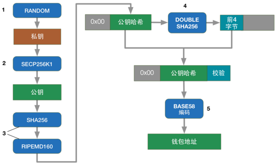
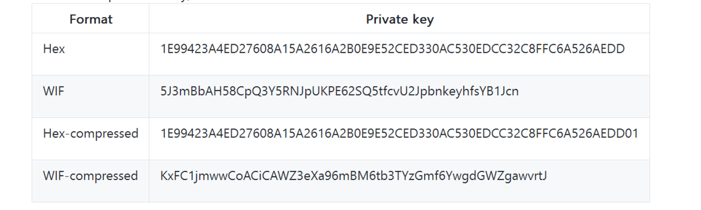

<!-- TOC -->

- [1. 相关知识](#1-相关知识)
- [2. 私钥/公钥/公钥哈希/钱包地址](#2-私钥公钥公钥哈希钱包地址)
- [3. 私钥/公钥/公钥哈希/钱包地址在bitcoin中](#3-私钥公钥公钥哈希钱包地址在bitcoin中)
- [4. sign/verify](#4-signverify)
- [5. 实现列表](#5-实现列表)

<!-- /TOC -->

# 1. 相关知识

* https://github.com/pointbiz/bitaddress.org (地址生成源码)
* https://www.bitaddress.org/ (比特币地址生成)
* http://book.8btc.com/books/6/masterbitcoin2cn/_book/ch04.html (精通比特币-第四章 秘钥和地址)
* https://en.bitcoin.it/wiki/List_of_address_prefixes (prefix)
* https://en.bitcoin.it/wiki/Wallet_import_format (wallet import format)
* http://www.youdzone.com/signature.html (签名+认证)
* https://blog.csdn.net/jeason29/article/details/51576659 (图片来源)

# 2. 私钥/公钥/公钥哈希/钱包地址

类型|方式|hex长度|byte长度
-|-|-|-
privateKeyBytes|ecdsa.GenerateKey|64|32
publicKeyBytes|ecdsa.GenerateKey|128|64
publicKeyHash|SHA256+RIPEMD160|40|20
walletAddress|Base58Encode|`34`|17
signature|ecdsa.Sign(私钥,hash(证书))|128|64
txId|SHA256|64|32

关系:  

流程图1:  

流程图1-补充:  

# 3. 私钥/公钥/公钥哈希/钱包地址在bitcoin中

私钥的存储格式:

公钥的存储格式:
* 未压缩格式: 04作为前缀,payload 128 hex, 一共130hex
* 压缩格式: 02或03作为前缀,payload 64 hex, 一共66hex

base58-encode addr  

# 4. sign/verify

* 私钥签名(hash(证书)) -> 签名
* 公钥解密(签名) == hash(证书)

签名交易流程:    

签名验证:    

一笔转账:    

# 5. 实现列表

* RANDOM 生成私钥
* SECP256K1 生成对应的公钥
* SHA256 + RIPEMD160 生成公钥哈希
* SHA256 + SHA256 生成公钥哈希的Checksum
* Base58Encode 版本号+公钥哈希+ChecksumCut 生成钱包地址
* 钱包地址提取公钥哈希
* 签名一笔交易
* 验证一笔交易
 