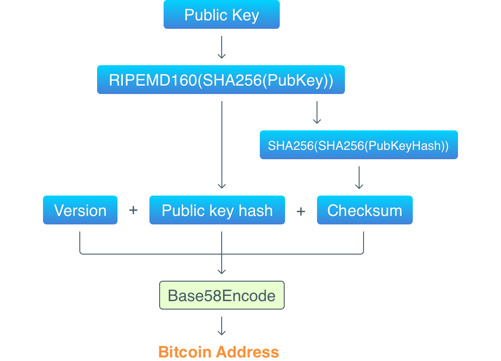

<!-- TOC -->

- [1. 图片](#1-图片)
- [2. 实现列表](#2-实现列表)

<!-- /TOC -->

# 1. 图片

流程图1  

流程图1-补充  

私钥,公钥,公钥哈希,钱包地址的关系  

签名交易流程  

签名验证  

# 2. 实现列表
* RANDOM 生成私钥
* SECP256K1 生成对应的公钥
* SHA256 + RIPEMD160 生成公钥哈希
* SHA256 + SHA256 生成公钥哈希的Checksum
* Base58Encode 版本号+公钥哈希+ChecksumCut 生成钱包地址
* 钱包地址提取公钥哈希
* 签名一笔交易
* 验证一笔交易
