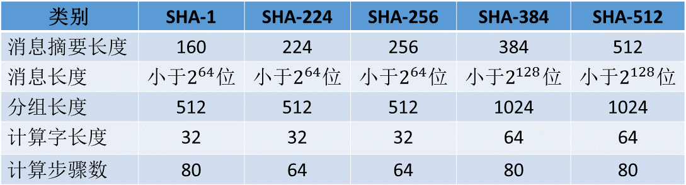

<!-- TOC -->

- [说明](#说明)

<!-- /TOC -->


<a id="markdown-说明" name="说明"></a>
# 说明




```bash
# sha256
消息摘要长度256位 --- 最终生成256位 -> 32字节 -> 64hex 串
消息长度小于2^64位 --- 被hash内容的位数 < 2^64
分组长度512位 --- 每个分组的大小为512位
计算字长度32位 --- 生成w0~w15,每个长度为32位
计算步骤数 --- 经过多少次的混淆?
```

