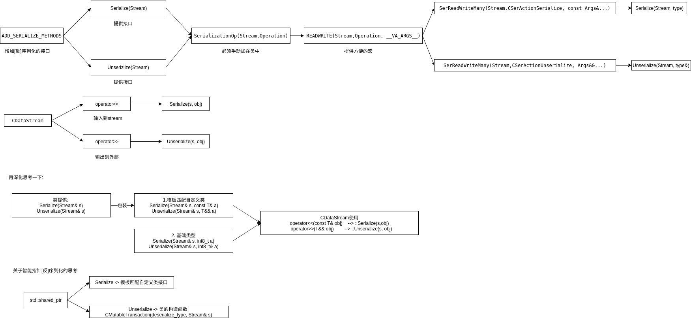

<!-- TOC -->

- [说明](#说明)

<!-- /TOC -->

# 说明

因为c++不具备反射的功能,所以在实现[反]序列化的时候要手动使用模板+宏来`增加序列化的接口`,达到编程者`输入最少的信息`即可`增加[反]序列化的接口`

bitcoin大概实现了:

* [u]int8_t
* [u]int16_t
* [u]int32_t
* [u]int64_t
* float
* double
* [unsigned]char[]
* span[const]\<unsigned char\>
* bool
* std::basic_string\<c\>
* std::pair
* std::map
* std::set
* std::shared_ptr
* std::unique_ptr
* 模板(自提供接口)

大概流程():

自问自答:

* 为什么用到了泛型?
因为Serialize,Unserialize处理到了不同的类型,所以用泛型来编译期生成不同类型的匹配代码

* 为什么用到了Operation(struct决定了泛型分发函数)?
也可以不使用,但是为了达到尽量高的复用程度. 这么做很值得.

