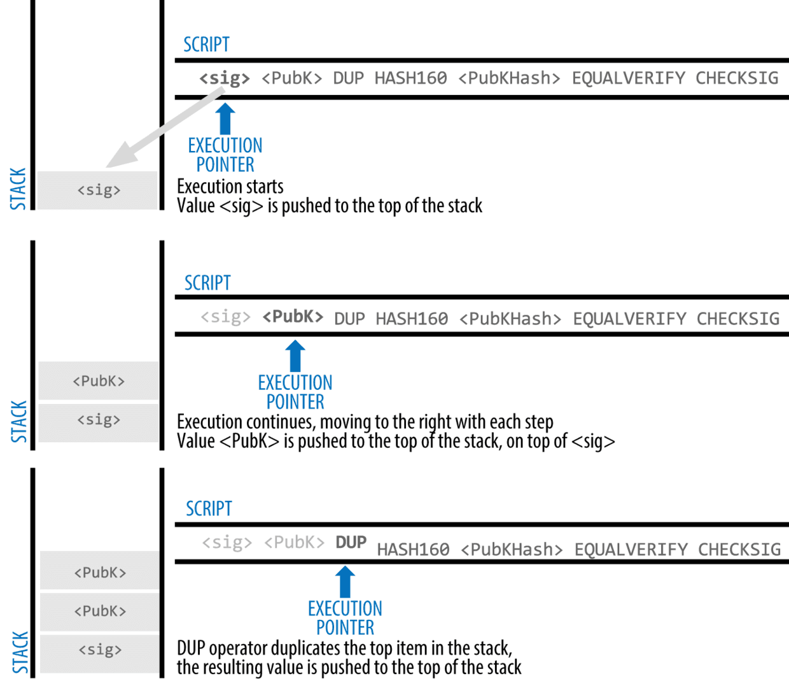
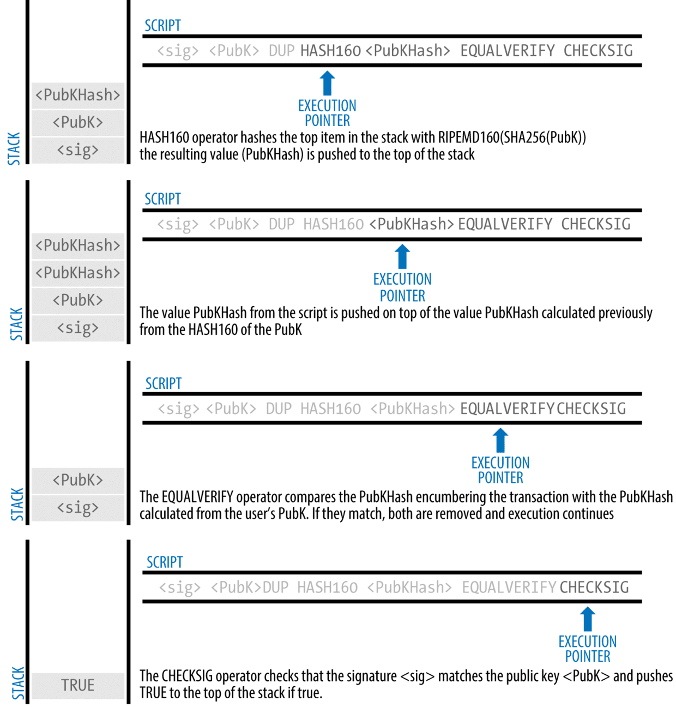

<!-- TOC -->

- [1. 说明](#1-说明)
- [2. 一个认证](#2-一个认证)

<!-- /TOC -->

# 1. 说明

* http://book.8btc.com/books/6/masterbitcoin2cn/_book/ch06.html
* https://en.bitcoin.it/wiki/Script
* https://en.bitcoin.it/wiki/Transaction (P2PkH P2SH)

# 2. 一个认证

