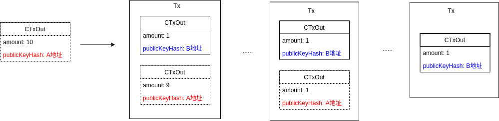

<!-- TOC -->

- [1. 说明](#1-说明)
    - [1.1. 更新维度](#11-更新维度)
    - [1.2. 连续转账维度](#12-连续转账维度)
- [2. 实现列表](#2-实现列表)

<!-- /TOC -->


<a id="markdown-1-说明" name="1-说明"></a>
# 1. 说明

<a id="markdown-11-更新维度" name="11-更新维度"></a>
## 1.1. 更新维度

utxo存储bucket,只保留`未花费输出`的数据,当产生交易时,要把`已花费输出`的数据删除.`让utxo存储bucket只保留有效的out数据.`

 


注意上面的三幅图片中的`虚线`,表达的意思就是,当完成转账后,在`utxo存储池`中,fromAddress->toAddress的fromAddress处理可能会有3种情况

* a. WalletAddr-B 全部转出,那么这笔`交易`在存储池中就被`删除`
* b. WalletAddr-B 转出,  WalletAddr-A 剩下, 那么就留下这笔交易,并`单独删除WalletAddr-B`
* c. WalletAddr-A 转出,  WalletAddr-B 剩下, 那么就留下这笔交易,并`单独删除WalletAddr-A`

<a id="markdown-12-连续转账维度" name="12-连续转账维度"></a>
## 1.2. 连续转账维度

假设场景
```go
// walletA余额: 10
// walletB余额: 0

for i := 0; i < 10; i++ {
    walletA -> walletB 
}
```
在utxo存储中如图:



两个角度的思考:
* `WalletAddr-A` 至始至终只有干净的一笔记录 -> `fromWalletAddress` 的`fromOuts`只要被用到就会产生新的tx,并去除冗余`fromOuts`
* `WalletAddr-A` 有多笔记录 -> `toWalletAddress`的`outPut`会不断的产生

---

当需要把多笔`toWalletAddress`的`outPut`累计成一笔大的outPut时,`walletB` -> `walletC`, 如图:


* `足以满足转账需求`的未花费输出都会被利用并且清除冗余

<a id="markdown-2-实现列表" name="2-实现列表"></a>
# 2. 实现列表

* 存储结构map [txId]outs
* publicKeyHash -> 满足金额的可花费输出, `返回map`
* publicKeyHash -> 所有的可花费输出, `返回list`
* 所有交易数
* 根据blockchain重建utxo存储层  *
* update (转账toWalletAddress时,`3种状态`更新fromWalletAddress)
